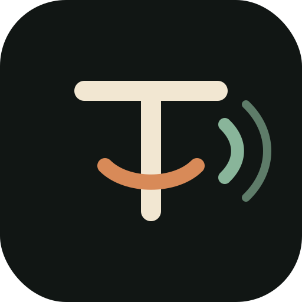

# Keyme




Mechanical keyboard sounds for Windows.

Keyme is a small Windows utility that adds satisfying switch-style audio to every key press. It runs locally, starts with Windows if you want it to, and includes a simple settings app for choosing sounds and volume.

## Features

- Global keyboard sounds across apps.
- Low-latency audio playback through your default Windows output.
- Stereo panning based on approximate key position.
- Per-key pitch variation so typing feels less repetitive.
- 11 built-in synthesized switch profiles.
- Small settings UI for profile, volume, status, and autostart.
- Local-first privacy model with no telemetry and no network calls.

## Sound Profiles

Keyme includes 11 procedural profiles from soft thock to loud vintage click. See [docs/profiles.md](docs/profiles.md).

## Install

Download the release ZIP, extract it, then double-click:

```text
Setup-Keyme.cmd
```

For development installs, you can also run:

```powershell
powershell.exe -NoProfile -ExecutionPolicy Bypass -File .\scripts\install.ps1
```

The installer copies Keyme to `%LOCALAPPDATA%\Keyme` and creates:

- `Keyme` desktop shortcut for the settings app.
- `Start Keyme` and `Stop Keyme` desktop shortcuts.
- Start Menu shortcuts under `Keyme`.
- A Startup shortcut so Keyme runs after login.

## Use

Open the `Keyme` desktop shortcut to change the profile, volume, or autostart setting.

You can also run it directly:

```powershell
cargo run --release -- --profile holy-panda --volume 75
```

## Uninstall

```powershell
powershell.exe -NoProfile -ExecutionPolicy Bypass -File .\scripts\uninstall.ps1
```

This stops Keyme and removes the shortcuts. It does not delete the source folder.

## Privacy

Keyme installs a Windows low-level keyboard hook so it can react to key presses. It only observes virtual-key codes, does not reconstruct typed text, does not store keystrokes, and does not use the network.

See [docs/privacy.md](docs/privacy.md) and [docs/architecture.md](docs/architecture.md) for more detail.

## Development

```powershell
cargo build --release
cargo run --release -- --help
```

The compiled app is written in Rust. The settings app and installer scripts are PowerShell/WinForms so the project stays easy to inspect and modify.

## Roadmap

- Optional tray icon.
- Licensed recorded WAV sound packs.
- Import your own switch samples.
- Mouse click and scroll sounds.
- Visual keyboard overlay.
- Signed installer.

## License

MIT
